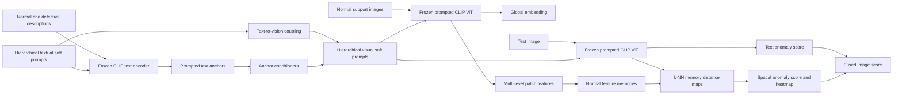

# Dual-Prompt Anomaly Detection

Research-grade PyTorch implementation of **“Multimodal Representation Learning via Dual Hierarchical Soft Prompting for Few-Shot Industrial Anomaly Detection”** for normal-only few-shot evaluation on MVTec AD.

> [!IMPORTANT]
> This is an independent implementation from the supplied manuscript, not an official author release. The manuscript states that code will be released after acceptance and leaves several inference constants unspecified. This repository makes those choices explicit and does not claim numerical parity with the paper until the authors' reference code and exact settings are available.

## What is implemented

- Frozen OpenCLIP ViT-B/16 QuickGELU image and text encoders.
- Auditable normal/defective hard-prompt ensembles with MVTec category defects.
- Learnable textual soft prompts at early, middle, and late text-transformer blocks.
- MaPLe-style token-wise coupling from textual prompts into visual prompts.
- Learnable visual soft prompts at matching vision-transformer blocks.
- Normal-only softmax adaptation with prompt/gate regularization.
- Per-layer normal patch-feature memories with bounded random subsampling.
- Cosine k-nearest-neighbor anomaly maps and multi-layer fusion.
- Fused semantic and spatial image anomaly scores.
- Image AUROC/AUPR and pixel AUROC/AUPR/Dice evaluation.
- Compact checkpoints, prediction CSVs, grayscale anomaly maps, deterministic sampling, CI, and tests.



## Installation

Python 3.10-3.12 is recommended. Create a clean environment, install the PyTorch build appropriate for your system, and then install this package:

```bash
python -m venv .venv
source .venv/bin/activate        # Windows: .venv\Scripts\activate
python -m pip install --upgrade pip
pip install torch torchvision --index-url https://download.pytorch.org/whl/cu128
pip install -e ".[dev]"
```

Use the [PyTorch installation selector](https://pytorch.org/get-started/locally/) if CUDA 12.8 is not appropriate. A CPU-only install is sufficient for tests but not recommended for full MVTec experiments. The first production run downloads OpenCLIP weights.

## MVTec AD

Download MVTec AD under its own license from the [official dataset page](https://www.mvtec.com/company/research/datasets/mvtec-ad), extract it locally, and keep it out of Git. The expected structure is:

```text
data/mvtec_anomaly_detection/
├── bottle/
│   ├── train/good/*.png
│   ├── test/good/*.png
│   ├── test/<defect>/*.png
│   └── ground_truth/<defect>/*_mask.png
├── cable/
└── ... 15 categories total
```

Validate the extraction before training:

```bash
dual-prompt inspect-data --root data/mvtec_anomaly_detection
```

The project never downloads or redistributes MVTec AD automatically.

## One-epoch smoke test

This runs the complete train → memory → inference → metrics → checkpoint path against a tiny deterministic MVTec-shaped fixture and a frozen toy backbone:

```bash
dual-prompt smoke --config configs/smoke.yaml
```

The fixture is only a software test. It is not MVTec AD, and its metrics have no research meaning.

For a real one-epoch MVTec integration check with OpenCLIP:

```bash
dual-prompt train \
  --config configs/mvtec_vit_b16.yaml \
  --category bottle \
  --epochs 1 \
  --data-root /path/to/mvtec_anomaly_detection \
  --output-dir outputs/mvtec_one_epoch
```

The final implementation was verified for one epoch on all 15 real four-shot MVTec categories. The macro mean was 89.68% image AUROC and 95.62% pixel AUROC; `bottle` achieved 97.46%/97.51%. These are pipeline verification results, not converged paper results; see [docs/VERIFICATION.md](docs/VERIFICATION.md).

## Paper-default training and evaluation

Train one category:

```bash
dual-prompt train --config configs/mvtec_vit_b16.yaml --category bottle
```

Train all 15 categories independently and report the unweighted mean:

```bash
dual-prompt train --config configs/mvtec_vit_b16.yaml --category all
```

Evaluate a saved category checkpoint:

```bash
dual-prompt evaluate \
  --config configs/mvtec_vit_b16.yaml \
  --checkpoint outputs/mvtec/bottle/checkpoint.pt
```

Each category run writes:

```text
outputs/mvtec/<category>/
├── checkpoint.pt
├── metrics.json
├── history.json
├── predictions.csv
├── run_metadata.json
└── anomaly_maps/*.png
```

An all-category run also writes `outputs/mvtec/summary.json` with every category and the unweighted macro mean.

## Reproducibility notes

The configuration deliberately distinguishes values stated in the paper from choices required because the manuscript leaves them symbolic.

| Setting | Repository default | Provenance |
|---|---:|---|
| Backbone | OpenCLIP ViT-B/16 QuickGELU, OpenAI weights | Paper backbone; QuickGELU matches the original OpenAI checkpoint |
| Input resolution | 224 × 224 | Paper |
| Text/visual prompt mode | dual | Title, narrative, and Figure 2; formal visual-only ablation is configurable |
| Text and visual prompt length | 4 | Paper |
| Text and visual prompt depths | blocks 0, 5, 11 | Paper says early/middle/late; exact indices are an implementation choice |
| Cross-modal coupling | token-wise linear text-to-vision projection | MaPLe-style implementation choice |
| Optimizer | SGD, momentum 0.9 | Paper |
| Initial learning rate | 3.5e-3 | Paper |
| Batch size | 4 | Paper |
| Epochs | 50 | Experiment prose; Table 2 instead says 100 |
| Maximum memory size | 1,024 per layer | Paper |
| Memory reduction | seeded random subset | Implementation choice; paper does not specify the algorithm |
| k-NN neighbors | 1 | Implementation choice |
| Layer weights | equal | Implementation choice |
| Semantic fusion weight | 0.5 | Implementation choice |
| Spatial top pixels | 100 at 224² | Implementation choice |
| Regularization coefficient | 1e-4 | Implementation choice |

The manuscript contains a real specification gap: its title, narrative, and Figure 2 show hierarchical textual and visual soft prompts, while Sections 3.3-3.7 formally define fixed text anchors and trainable visual prompts only. The default `dual` mode follows the stated MaPLe-like concept by replacing reserved text-context positions at selected text blocks and coupling those prompts into the visual branch. The exact formal equations remain reproducible through `model.prompt_mode: visual_only`. Both choices are labeled rather than conflated.

See [docs/METHODOLOGY.md](docs/METHODOLOGY.md) for the equation-to-code map, [docs/REPRODUCIBILITY.md](docs/REPRODUCIBILITY.md) for the evaluation protocol, and [docs/VERIFICATION.md](docs/VERIFICATION.md) for the completed test record.

## Development

```bash
ruff check .
ruff format --check .
pytest
```

Tests do not require model downloads or the real dataset. The end-to-end test runs one epoch with the toy frozen backbone.

## Scope and limitations

- The project implements the MVTec AD path; VisA and the private carbon-fiber dataset are outside this repository's validated scope.
- Pixel maps are evaluated after resize to the configured square input size, consistent with the model input. No test-time fitting occurs.
- Random memory reduction is transparent and deterministic but is not equivalent to a learned or k-center coreset.
- Exact paper results cannot be guaranteed from a preprint that omits numerical inference settings and contains conflicting epoch counts.

## Citation

Use the metadata in [CITATION.cff](CITATION.cff). Cite the original manuscript for the method and this repository for the implementation.

## License

Code is released under the [MIT License](LICENSE). MVTec AD and pretrained model weights retain their respective licenses and are not distributed here.
